<div align="center">


# TIDAL DOWNLOADER

[English](README.md) | **한국어**

Tidal을 위한 고음질 데스크톱 클라이언트 — 무손실 **FLAC** 다운로드(16비트 / 24비트, 최대 192 kHz HI_RES_LOSSLESS), **플레이리스트** 통째로 받기, **비트퍼펙트** 재생(Windows: WASAPI 배타 모드, macOS: Core Audio Hog Mode), 라이브러리 정리와 일괄 태그 편집까지.<br>Electron + React 기반, Windows / macOS 지원.

[](https://github.com/ARCLIGHTSTRVL/tidal-downloader/releases/latest)
[](https://github.com/ARCLIGHTSTRVL/tidal-downloader/releases)
[]()
[](LICENSE)

</div>

> **상태:** v1.0.3 — **Windows와 macOS 모두 안정 버전.** 이번 릴리스에서 macOS 네이티브 빌드(Apple Silicon + Intel)와 비트퍼펙트 Core Audio Hog Mode, 플레이리스트 시스템 전체, 한국어/영어 UI, 업데이트 알림, 그리고 대규모 파일 안전성 강화가 들어갔습니다. 의견은 [Issues](../../issues)로 보내주세요.

---

## 스크린샷

<table>
  <tr>
    <td>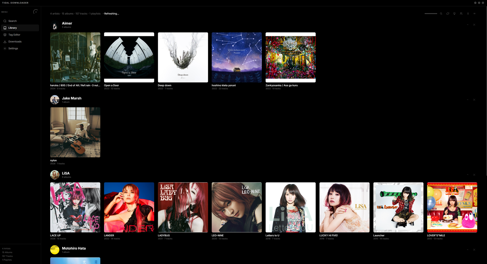</td>
    <td>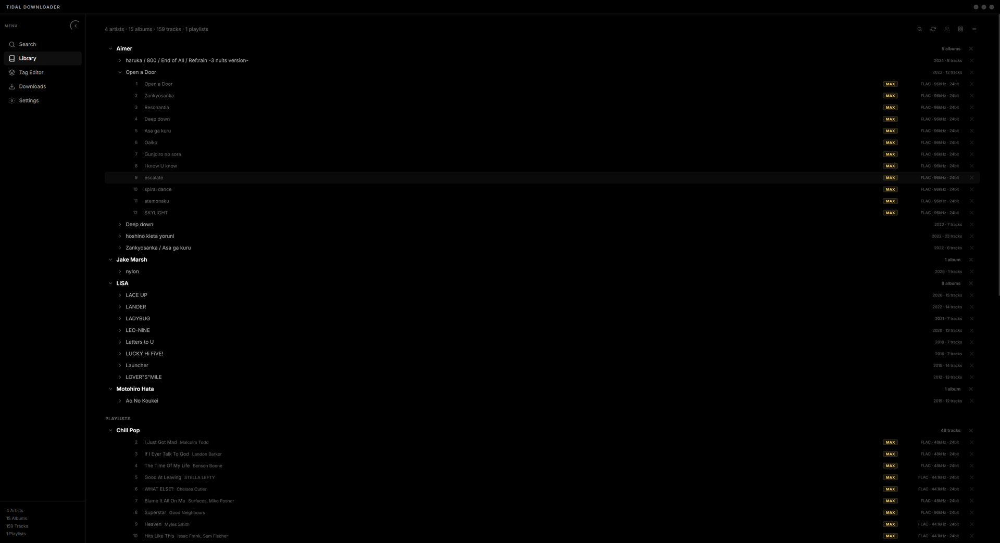</td>
  </tr>
  <tr>
    <td>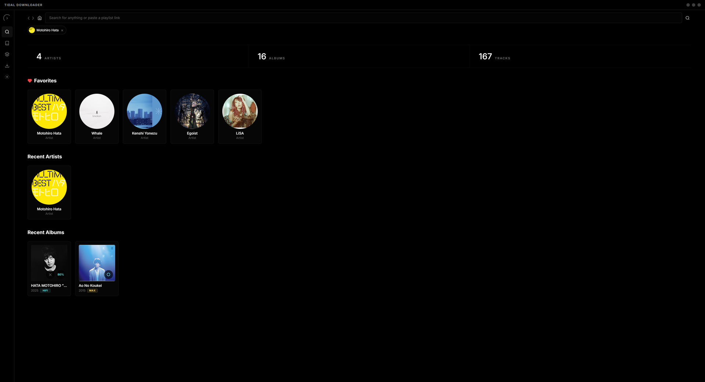</td>
    <td>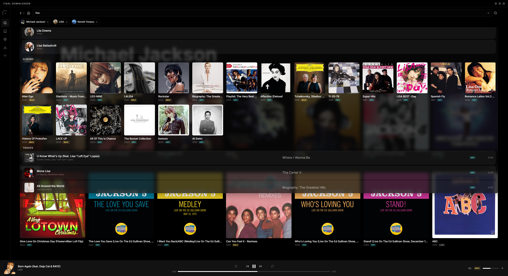</td>
  </tr>
  <tr>
    <td>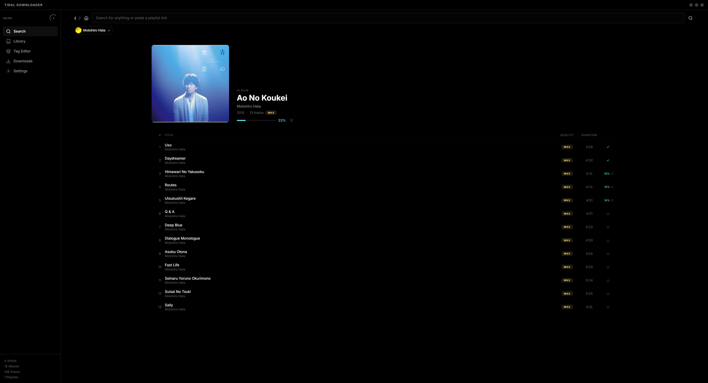</td>
    <td></td>
  </tr>
  <tr>
    <td>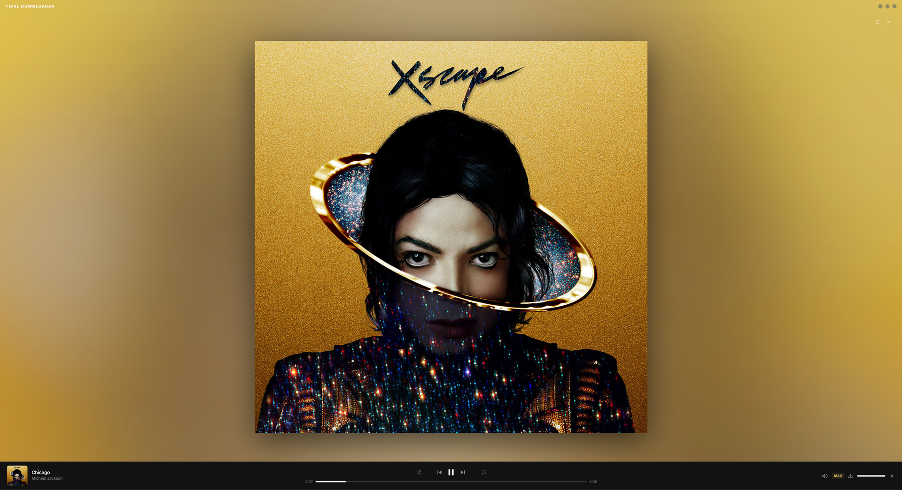</td>
    <td>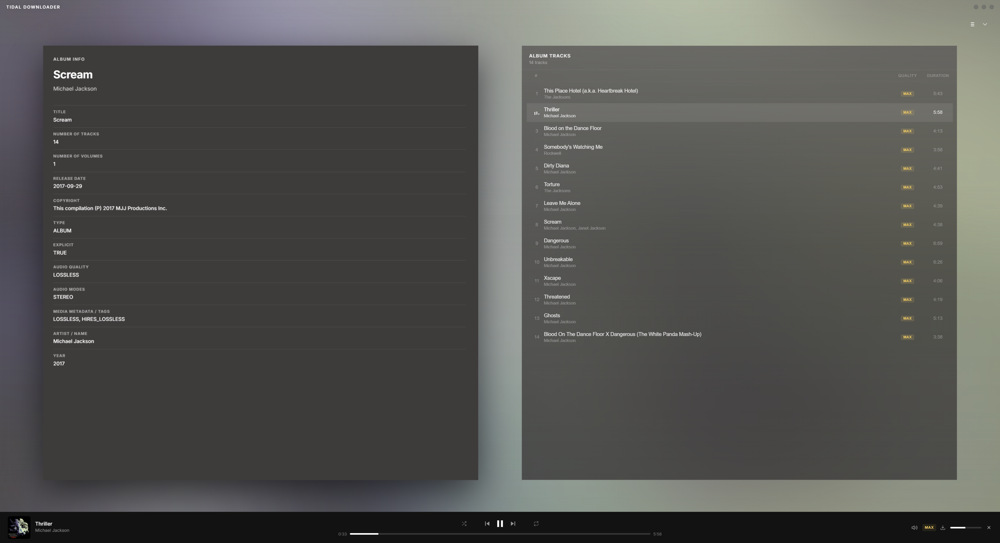</td>
  </tr>
  <tr>
    <td>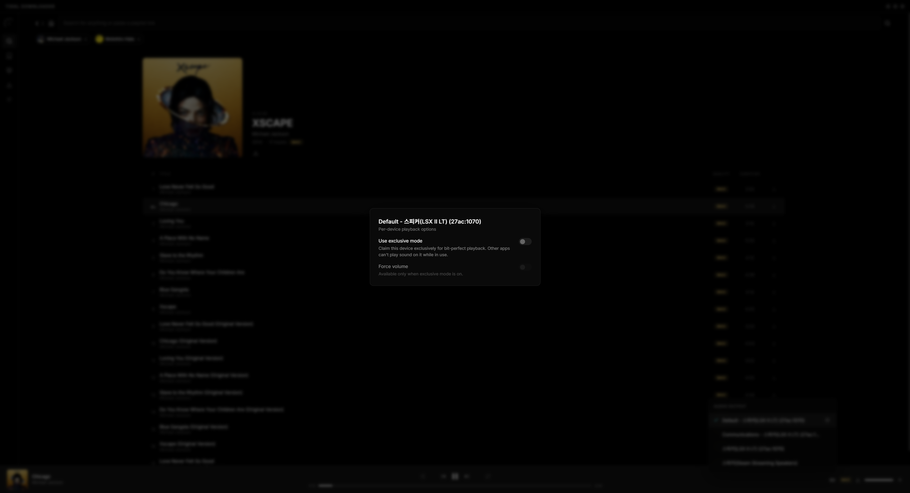</td>
    <td>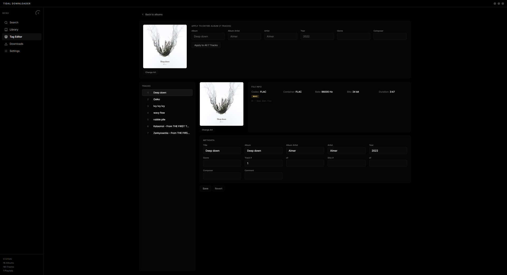</td>
  </tr>
  <tr>
    <td>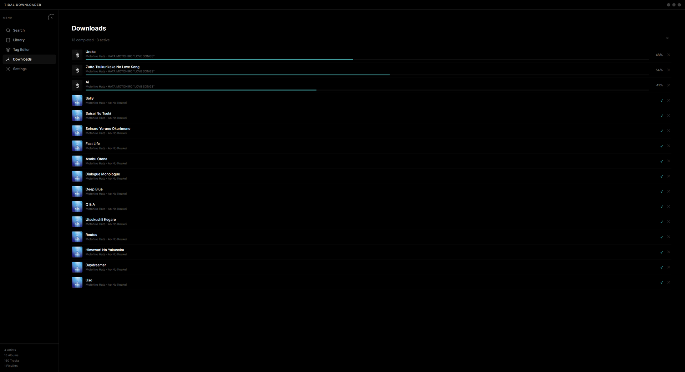</td>
    <td>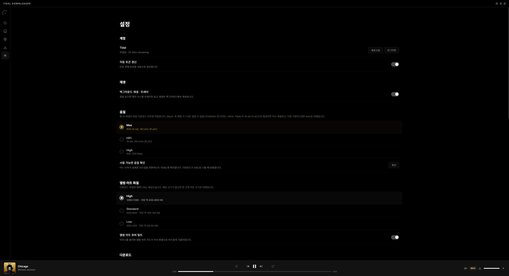</td>
  </tr>
</table>

## 동작 방식

- Tidal의 FLAC 스트림을 표준 FLAC 그대로 저장합니다 — 재인코딩 없음, MP4 래퍼 없음. HI_RES_LOSSLESS 트랙은 24비트 96/192 kHz로 저장됩니다.
- HI_RES_LOSSLESS에 쓰이는 DASH 매니페스트는 세그먼트를 조립한 뒤 ffmpeg로 무손실 remux(`-c:a copy`)합니다.
- 재생은 양 플랫폼 모두 비트퍼펙트: Windows는 **WASAPI 배타 모드**, macOS는 **Core Audio Hog Mode** — 장치를 독점 점유하고 음원의 네이티브 샘플레이트로 직접 전환합니다.
- 모든 다운로드가 Tidal 고유 정체성을 오디오 컨테이너 안에 직접 내장합니다(아래 참고). 라이브러리 인덱스는 이 태그만으로 오프라인 재구축이 가능합니다.
- Windows 인스톨러는 ARCLIGHTSTRVL의 Authenticode 서명이 되어 있습니다.

## 트랙 정체성 내장

이 앱이 단순 다운로더와 다른 핵심: **저장하는 모든 파일이 자기 자신의 Tidal 정체성을 오디오 컨테이너 안에 품고 있습니다** — 고유 `TIDAL_GUID`와 `TIDAL_META` 레코드(Tidal 트랙 ID, 원본 제목/아티스트/앨범)를 FLAC은 Vorbis 코멘트로, M4A는 iTunes 박스로 기록합니다. 정체성이 데이터베이스가 아니라 파일 자체에 있기 때문에:

- **앱이 자기 다운로드를 항상 알아봅니다.** 파일명을 바꾸든, 태그를 고치든, 다른 폴더로 옮기든 — 다운로드 ✓ 표시, 앨범 그룹핑, 중복 감지가 파일명이나 제목이 아닌 내장 정체성으로 검증되어 정확하게 유지됩니다.
- **라이브러리가 무엇에도 살아남습니다.** 앱을 지우거나, 음악을 새 컴퓨터로 옮기거나, 라이브러리 인덱스를 통째로 잃어도 — 오프라인 **Rebuild** 한 번이면 파일 안의 태그만으로 인덱스 전체가 복원됩니다. 인터넷도 필요 없습니다.
- **가짜가 끼어들 수 없습니다.** 다른 곳에서 온 동명 파일이 검증된 다운로드로 위장할 수 없습니다 — 일치하는 내장 정체성이 없는 파일은 절대 다운로드로 취급되지 않습니다.
- **표준 태그, 종속성 제로.** 어떤 태깅 도구로도 읽을 수 있는(원하면 지울 수도 있는) 평범한 메타데이터 필드입니다 — 파일은 어디서든 재생되는 그냥 FLAC/M4A입니다.

## 기능

- **Tidal의 모든 음질 지원** — Max(HI_RES_LOSSLESS 24비트 최대 192 kHz FLAC), HiFi(16/44.1 FLAC), High(AAC 320 kbps, 정식 `.m4a`) — 전부 동일한 정체성 내장·라이브러리 기능 지원, 재인코딩 없음
- **최고 음질 DASH 지원** — HI_RES_LOSSLESS(24비트 / 96 kHz / 192 kHz) 세그먼트 조립 + ffmpeg remux
- **플레이리스트** — Tidal 플레이리스트 탐색(검색 결과, 내 플레이리스트+즐겨찾기, 최근 열람), 링크나 UUID를 붙여넣어 바로 열기, `playlists/<이름>/` 전용 폴더로 일괄 다운로드(플레이리스트 순번 파일명 + 커버 아트), 라이브러리의 전용 그룹으로 관리
- **비트퍼펙트 출력** — Windows: WASAPI 배타 모드 + 네이티브 샘플레이트 협상 + 볼륨 고정 옵션. macOS: Core Audio Hog Mode + 노미널 샘플레이트 매칭
- **빠른 앨범 다운로드** — 앨범 트랙 3개 동시 다운로드, Max 음질 DASH는 트랙별 세그먼트 병렬
- **라이브러리** — 자동 스캔되는 `아티스트 > 앨범` 트리, 리스트/그리드 뷰, 라이브러리 전체 이어듣기, 현재 곡 하이라이트, 플레이리스트 포함 검색
- **태그 편집기** — 앨범 단위 일괄 편집, 앨범 아트 내장, 드래그-드롭 파일/폴더 가져오기, 다중 루트 새로고침
- **검색 & 탐색** — 아티스트/앨범 검색과 디스코그래피(앨범 / EP & 싱글), 즐겨찾기, 최근 기록, 검색 홈의 라이브러리 통계
- **재생** — 전용 `local://` 프로토콜 기반 로컬 재생, 셔플/반복(끄기 → 한 곡 → 앨범), 반응형 시크 바
- **앨범 아트** — 내장 품질 선택(320 / 640 / 1280), 호버 틸트, 원본 해상도 라이트박스, 아트 전용 저장 경로
- **업데이트 알림** (Windows + macOS) — 백그라운드 버전 확인 후 최신 릴리스로 안내하는 토스트, 설정에서 수동 확인 가능
- **English / 한국어** — 설정에서 UI 언어 즉시 전환
- **영속 상태** — Tidal 정식 ID 기반 라이브러리 인덱스(*LiSA* vs *LISA* 같은 동명 아티스트 구분), 다운로드 ✓ 표시는 내장 식별자로 검증되어 태그를 고치거나 파일명을 바꿔도 유지
- **히스토리 내비게이션** — 마우스 엄지 버튼(XButton1 / XButton2)으로 앱 전체 뒤로/앞으로
- **음질 프로브** — 내 구독 티어가 실제로 무손실을 주는지 샘플 트랙으로 빠르게 확인(설정 → 사용 가능 음질 확인)
- **라이브러리 유지보수** — Tidal 온라인 기준 메타데이터 재동기화 + 파일 재정리, 또는 파일에 내장된 식별 태그(FLAC·M4A)만으로 인덱스 오프라인 재구축(Rebuild)

## 다운로드

### v1.0.3 (Windows + macOS)

[Releases](../../releases/latest)에서 받을 수 있습니다.

| 플랫폼 | 파일 | 크기 |
|--------|------|------|
| Windows 10/11 (x64) | `TIDAL DOWNLOADER Setup 1.0.3.exe` | 약 119 MB |
| macOS Apple Silicon (arm64) | `TIDAL DOWNLOADER-1.0.3-arm64.dmg` | 약 129 MB |
| macOS Intel (x64) | `TIDAL DOWNLOADER-1.0.3.dmg` | 약 141 MB |

> macOS 빌드는 **무서명**입니다(Apple Developer 공증은 로드맵에 있음) — 아래 설치 단계의 1회성 "그래도 열기" 절차를 참고하세요.

## 설치

### Windows
1. 최신 릴리스에서 `TIDAL DOWNLOADER Setup 1.0.3.exe`를 받습니다.
2. 인스톨러를 실행합니다 — **ARCLIGHTSTRVL** Authenticode 서명이 되어 있어 SmartScreen에 걸리지 않아야 정상입니다.
3. 마법사를 따라가면 됩니다. 사용자 단위 설치, 관리자 권한 불필요.

### macOS
1. CPU에 맞는 `.dmg`를 받습니다(Apple Silicon은 `arm64`, Intel은 `x64`).
2. 마운트한 뒤 *TIDAL DOWNLOADER*를 `/Applications`로 끌어 넣습니다.
3. 첫 실행 시 macOS가 차단하면 **시스템 설정 → 개인정보 보호 및 보안**에서 **"그래도 열기"**를 누릅니다(최초 1회). 구버전 macOS에서는 우클릭 → **열기**로도 됩니다.
4. 또는 터미널에서 격리 플래그를 제거해도 됩니다: `xattr -cr "/Applications/TIDAL DOWNLOADER.app"`.

## 요구 사항

- **Tidal 구독** — 무손실/최고 음질 다운로드에는 HiFi 또는 HiFi Plus가 필요합니다.
- **Windows 10/11 (x64)** 또는 **macOS 10.15+** (Intel / Apple Silicon).
- 여유 디스크 약 250 MB(음악 라이브러리 제외).

## 빠른 시작

1. 앱을 실행하고 Tidal 기기 코드 로그인으로 로그인합니다(기본 브라우저가 짧은 코드와 함께 자동으로 열립니다).
2. **설정 → 다운로드 위치**에서 다운로드 폴더를 지정합니다. 앨범 아트 폴더는 `<다운로드 경로>/art`로 자동 설정됩니다.
3. 아티스트나 앨범을 검색하거나 플레이리스트 링크를 붙여넣고 — 트랙의 **다운로드**, 앨범의 **전체 다운로드**, 또는 플레이리스트 일괄 다운로드를 누릅니다.
4. **라이브러리** 탭에서 받은 음악을 재생합니다 — 리스트 모드로 훑고, 그리드 모드로 시각적으로 탐색하고, 전용 플레이리스트 그룹으로 관리합니다.
5. 보관/공유 전 정리는 **태그 편집기**의 일괄 편집으로.

## 음질

Max·HiFi 다운로드는 표준 FLAC으로 저장됩니다(MP4 래퍼 없음). Tidal 매니페스트가 DASH(HI_RES_LOSSLESS)면 세그먼트를 조립해 ffmpeg로 무손실 remux(`-c:a copy`)합니다. High 티어는 진짜 AAC 320 kbps를 `.m4a`로 저장합니다. 어떤 경우에도 재인코딩·위장은 없습니다 — 무손실 티어가 제공되지 않는 트랙은 자연스럽게 폴백하며, 재인코딩된 AAC를 FLAC으로 속여 저장하지 않습니다.

오디오 장치 선택기의 **배타 모드 사용**을 켜면 장치를 독점 점유해 음원의 샘플레이트/비트 심도(16/44.1, 24/96, 24/192)에 맞춰 비트퍼펙트로 출력합니다 — Windows는 WASAPI 배타 모드, macOS는 Core Audio Hog Mode.

## 버그 신고

버그나 기능 요청은 [Issues 페이지](../../issues)에 올려주세요.

버그 신고 시 포함해 주세요:
- 앱 버전(**설정 → About** 하단)
- OS와 버전
- 재현 방법
- Tidal 구독 티어(HiFi / HiFi Plus)
- 재현 가능하면 콘솔 출력 — Windows는 PowerShell에서:
  ```powershell
  $env:ELECTRON_ENABLE_LOGGING=1
  & "$env:LOCALAPPDATA\Programs\tidal-downloader\TIDAL DOWNLOADER.exe"
  ```

## 면책 조항

이 앱은 비공식 서드파티 도구이며, Tidal 또는 Aspiro AB와 **아무런 제휴·후원·보증 관계가 없습니다**.

Tidal 서비스 약관 준수는 사용자 본인의 책임입니다. 다운로드는 구독으로 이미 비용을 지불한 음악을 개인적, 오프라인으로 듣기 위한 용도입니다. **다운로드한 콘텐츠를 재배포하지 마세요.**

내부적으로 ffmpeg를 사용하며 LGPL-2.1+ 라이선스를 따릅니다 — 자세한 내용은 [ffmpeg.org/legal.html](https://ffmpeg.org/legal.html)을 참고하세요. 번들 바이너리는 [`ffmpeg-static`](https://www.npmjs.com/package/ffmpeg-static)에서 가져옵니다.

## 라이선스

Copyright © 2026 **ARCLIGHTSTRVL**. All rights reserved.

컴파일된 애플리케이션은 개인 사용 목적으로 있는 그대로 제공됩니다. 소스 코드는 공개되지 않습니다. 전체 조건은 [LICENSE](LICENSE)를 참고하세요.

## 후원

TIDAL DOWNLOADER가 유용했다면 [Ko-fi](https://ko-fi.com/arclights)에서 개발을 후원할 수 있습니다. 모든 후원이 프로젝트 유지에 큰 힘이 됩니다 — 감사합니다.

[](https://ko-fi.com/arclights)

---

Built by **ARCLIGHTSTRVL**.
