<div align="center">


# TIDAL DOWNLOADER

[English](README.md) | **한국어**

Tidal 음악을 다운로드하고, 재생하고, 폴더와 태그를 정리하는 앱입니다.<br>Windows와 macOS에서 사용할 수 있습니다.

[](https://github.com/ARCLIGHTSTRVL/tidal-downloader/releases/latest)
[](https://github.com/ARCLIGHTSTRVL/tidal-downloader/releases)

[](LICENSE)

## 다운로드

### v1.0.5 (Windows + macOS)

이번 버전은 이름 규칙 편집, 앨범 유형별 폴더 분류, 라이브러리 정렬을 개선했습니다. 자세한 내용은 [릴리스 안내](https://github.com/ARCLIGHTSTRVL/tidal-downloader/releases/tag/v1.0.5)와 [변경 기록](CHANGELOG.md)을 참고하세요.

<table align="center">
  <thead>
    <tr>
      <th align="center">플랫폼</th>
      <th align="center">다운로드</th>
    </tr>
  </thead>
  <tbody>
    <tr>
      <td align="center">Windows 10/11 (x64)</td>
      <td align="center"><a href="https://github.com/ARCLIGHTSTRVL/tidal-downloader/releases/download/v1.0.5/TIDAL-DOWNLOADER-Setup-1.0.5.exe">설치 파일 .exe</a></td>
    </tr>
    <tr>
      <td align="center">macOS 12+ Apple Silicon (arm64)</td>
      <td align="center"><a href="https://github.com/ARCLIGHTSTRVL/tidal-downloader/releases/download/v1.0.5/TIDAL-DOWNLOADER-1.0.5-arm64.dmg">DMG</a> · <a href="https://github.com/ARCLIGHTSTRVL/tidal-downloader/releases/download/v1.0.5/TIDAL-DOWNLOADER-1.0.5-arm64-mac.zip">ZIP</a></td>
    </tr>
    <tr>
      <td align="center">macOS 12+ Intel (x64)</td>
      <td align="center"><a href="https://github.com/ARCLIGHTSTRVL/tidal-downloader/releases/download/v1.0.5/TIDAL-DOWNLOADER-1.0.5.dmg">DMG</a> · <a href="https://github.com/ARCLIGHTSTRVL/tidal-downloader/releases/download/v1.0.5/TIDAL-DOWNLOADER-1.0.5-mac.zip">ZIP</a></td>
    </tr>
  </tbody>
</table>

Intel용 빌드는 Apple Silicon의 Rosetta에서 실행을 확인했습니다. Intel Mac 실기 검증은 하지 않았습니다.

</div>

## 스크린샷

일부 스크린샷은 이전 버전의 설정 화면입니다. 현재 이름 규칙 편집 방법은 [사용자 가이드](docs/USER_GUIDE.md#download)를 참고하세요.

<table>
  <tr>
    <td>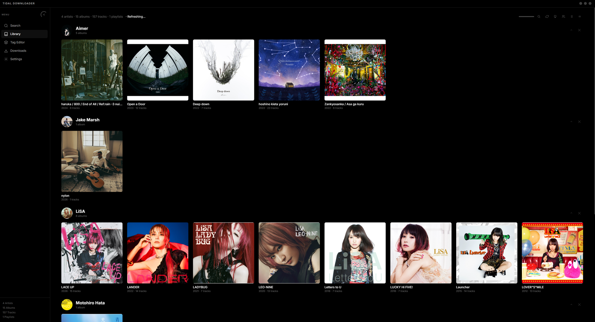</td>
    <td>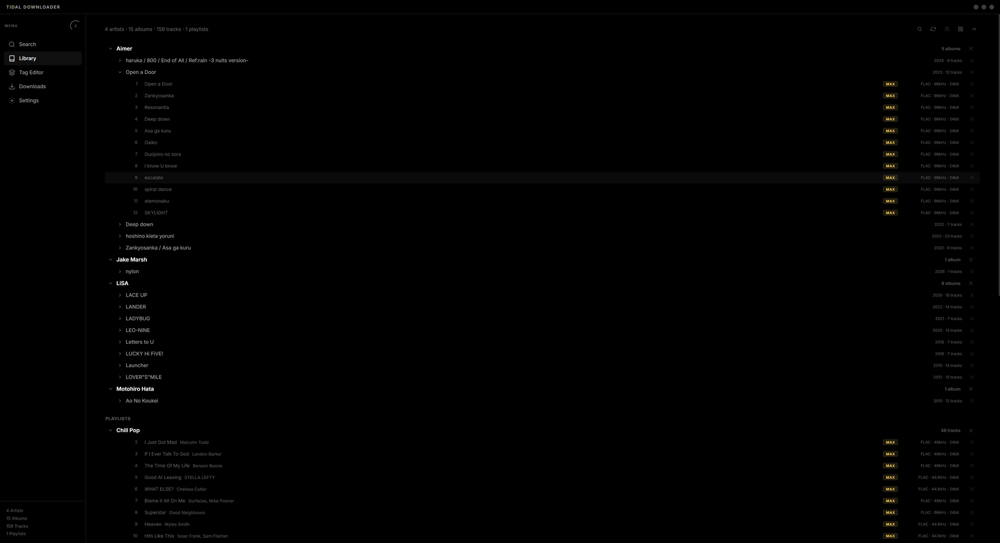</td>
  </tr>
  <tr>
    <td>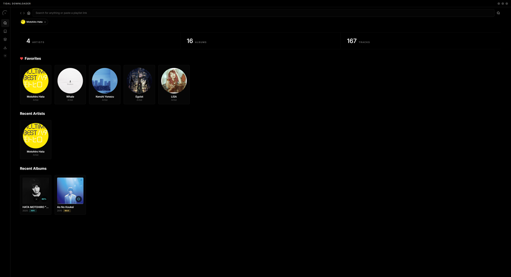</td>
    <td>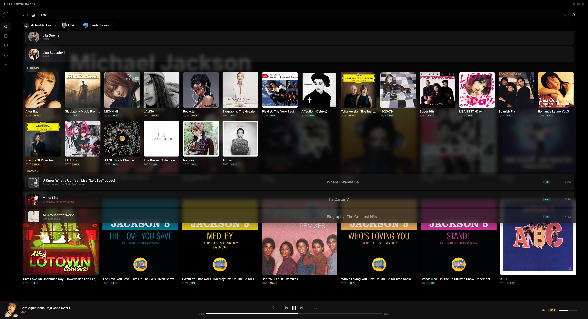</td>
  </tr>
  <tr>
    <td>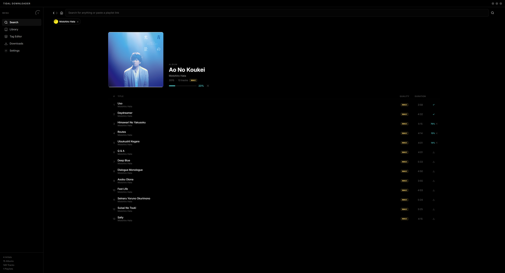</td>
    <td></td>
  </tr>
  <tr>
    <td>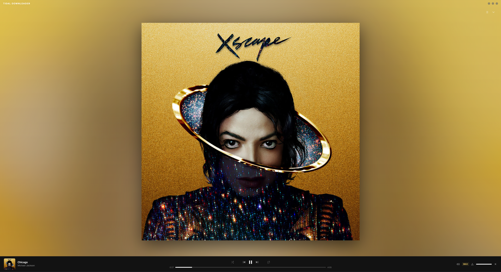</td>
    <td>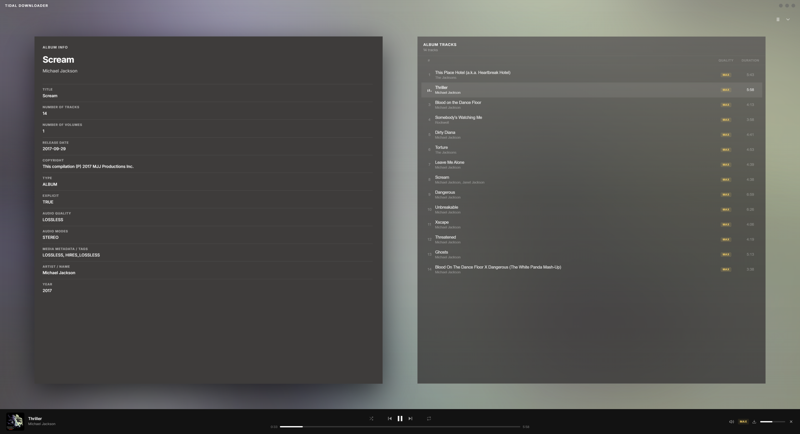</td>
  </tr>
  <tr>
    <td>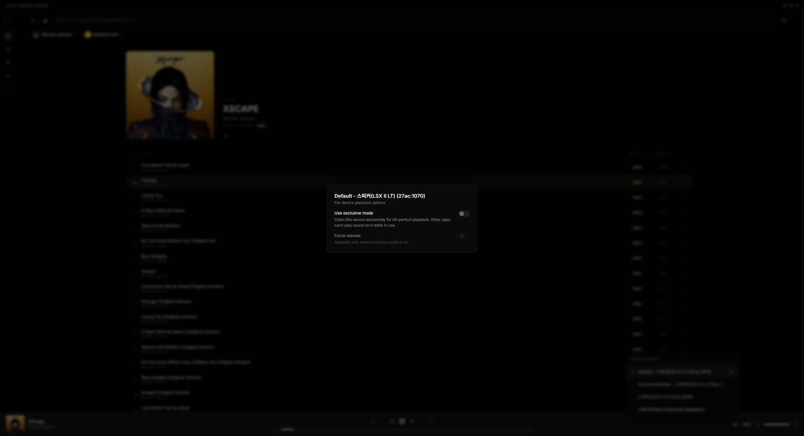</td>
    <td>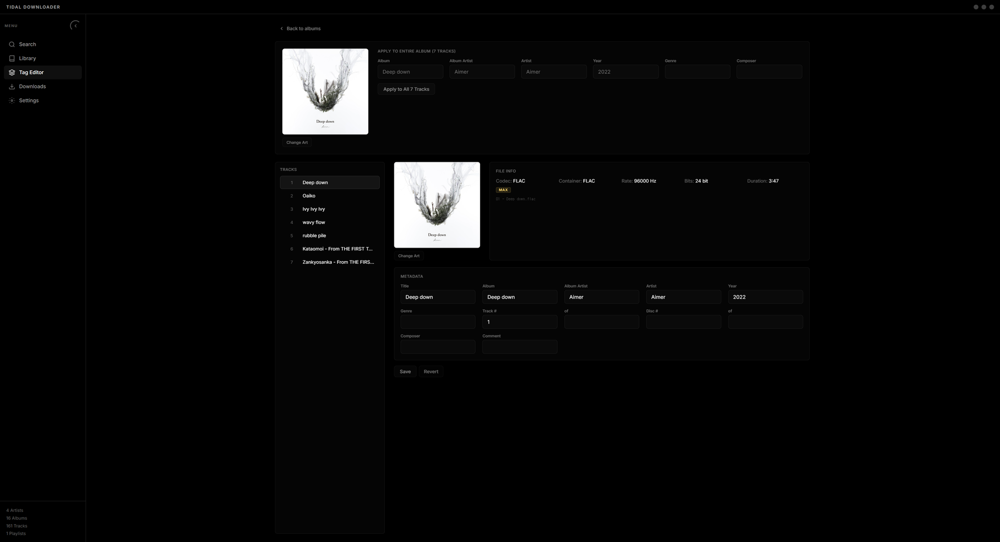</td>
  </tr>
  <tr>
    <td>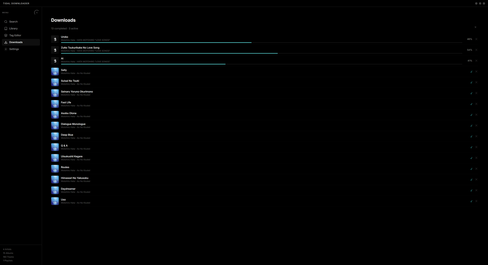</td>
    <td>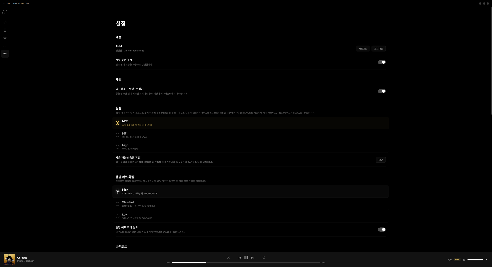</td>
  </tr>
</table>

## 요구 사항

- Windows 10/11 x64 또는 macOS 12 Monterey 이상
- 활성 Tidal 구독. 제공 음질은 계정·지역·곡에 따라 달라질 수 있습니다.
- 앱, 음악과 다운로드 임시 파일을 저장할 여유 공간

## 설치

### Windows

1. 위의 설치 파일 `.exe`를 받아 실행합니다.
2. 설치 마법사에서 위치를 선택합니다. 사용자 단위 설치는 보통 관리자 권한이 필요하지 않지만, 모든 사용자용 설치나 보호된 기존 설치 경로에는 필요할 수 있습니다.

설치 파일에는 ARCLIGHTSTRVL의 자체 서명과 타임스탬프가 있습니다. Windows의 신뢰 경고나 SmartScreen 경고가 나타날 수 있습니다.

### macOS

1. Mac에 맞는 DMG를 받습니다. Apple Silicon은 `arm64`, Intel은 `x64`입니다.
2. DMG를 열고 **TIDAL DOWNLOADER**를 **응용 프로그램**으로 끌어 넣습니다. 업데이트라면 기존 앱을 종료한 뒤 대치합니다.
3. 설치용 디스크를 꺼낸 뒤 응용 프로그램 폴더에서 앱을 실행합니다. ZIP을 받았다면 압축을 푼 뒤 앱을 응용 프로그램 폴더로 옮기면 됩니다.

Mac 배포본은 Apple Developer ID 서명·공증을 거치지 않아 Gatekeeper 기본 검사에서 차단됩니다. 실행을 허용하려면 **시스템 설정 → 개인정보 보호 및 보안 → 그래도 열기**를 선택하세요. Monterey에서는 **시스템 환경설정 → 보안 및 개인 정보 보호**에 있습니다.

### 이전 버전에서 업데이트

위 배포 파일로 수동 업데이트해 주세요. 트레이나 메뉴 막대에 남은 앱까지 먼저 종료합니다. 현재 서명 방식에서는 자동 설치가 원활하지 않을 수 있습니다.

다운로드 경로와 이름 규칙 등 기존의 유효한 저장 설정은 유지합니다. 설정을 초기화할 필요는 없으며, 앱 업데이트만으로 기존 음악 파일이 재정리되지는 않습니다.

## 빠른 시작

1. 앱을 열고 **로그인**을 누른 뒤 Tidal 로그인 창에서 인증을 완료합니다.
2. **설정 → 다운로드 위치**에서 음악을 저장할 폴더를 선택합니다.
3. 첫 다운로드 전에 음질과 **다운로드 이름 규칙**을 정합니다. 폴더·파일 규칙을 직접 입력하거나 태그로 조합하고, 미리보기를 확인한 뒤 **저장**합니다.
4. 아티스트나 앨범을 검색하거나 플레이리스트 링크를 붙여 넣습니다. 한 곡은 해당 곡의 다운로드 아이콘을, 앨범은 앨범 정보 아래의 다운로드 아이콘을 누릅니다.
5. 받은 음악은 **라이브러리**에서 재생합니다. 메타데이터와 앨범 아트는 **태그 편집기**에서 수정할 수 있습니다.

새 설정의 기본값은 `앨범 아티스트/앨범` 폴더와 `트랙 번호 - 제목` 파일명입니다. 기존에 저장한 유효한 규칙은 그대로 사용합니다. 규칙을 바꾸고 저장하면 이후 다운로드부터 적용됩니다. 기존 파일을 앨범 유형별로 분류하려면 **기존 라이브러리 앨범 분류 → 미리보기**에서 예정 경로를 확인한 뒤 **적용**을 눌러 주세요.

플레이리스트 사용법, 이름 규칙 예시와 라이브러리 관리 방법은 [사용자 가이드](docs/USER_GUIDE.md)에 있습니다.

## 기능

- 아티스트·앨범·플레이리스트 검색, 한 곡 또는 앨범·플레이리스트 다운로드
- 직접 입력과 태그 조합으로 폴더·파일 이름 편집, 프리셋과 예시 미리보기
- `Albums`, `EPs`, `Singles`, `Compilations` 폴더로 앨범 유형별 분류
- 라이브러리 리스트·그리드 보기, 앨범 정렬과 플레이리스트 관리
- 여러 곡의 태그와 앨범 아트 일괄 편집
- 로컬 음악 재생, 셔플·반복과 출력 장치 선택
- 설정에서 한국어·영어 전환

## 음질

| 설정 | 요청하는 음질 |
|------|---------------|
| Max | 최대 24비트 / 192 kHz FLAC |
| HiFi | 16비트 / 44.1 kHz FLAC |
| High | 320 kbps AAC |

무손실 음원을 받을 수 없으면 **Max·HiFi에서도 High로 내려가 AAC가 `.m4a`로 저장될 수 있습니다.** 곡에 표시된 실제 음질을 확인해 주세요. **설정 → 사용 가능한 음질 확인**에서는 샘플 곡으로 현재 계정에 제공되는 음질을 확인할 수 있습니다.

<a id="동작-방식"></a>

FLAC 스트림은 `.flac`, AAC 스트림은 `.m4a`로 저장합니다. 다운로드할 때 오디오를 재인코딩하지 않습니다.

### 오디오 출력

**Use exclusive mode**는 Windows의 WASAPI 독점 출력 또는 macOS의 Core Audio Hog Mode를 요청합니다. 출력 형식은 장치가 지원하는 범위에 따라 달라지고, 독점 재생에 실패하면 공유 출력으로 재생될 수 있습니다. 볼륨을 조절해도 오디오가 달라지므로, 독점 모드를 켰다는 것만으로 비트퍼펙트 재생이 보장되지는 않습니다.

## TIDAL 원본 정보 내장

앱은 지원하는 FLAC·M4A 파일의 `TIDAL_GUID`와 `TIDAL_META` 필드에 Tidal 식별정보를 저장합니다. 파일명을 바꾼 뒤에도 원본을 확인하고 라이브러리 인덱스를 오프라인으로 복구하는 데 쓰이므로, 다른 태그 편집기를 사용할 때 이 필드를 보존해 주세요.

앱 밖에서 파일을 옮겼다면 현재 위치에서 라이브러리를 새로고침하거나 재구축해야 합니다. 식별정보가 없거나 손상된 파일은 복구되지 않을 수 있습니다. 일부 구형 라이브러리 기록은 제목으로도 파일을 매칭하므로, 다운로드 ✓ 표시만으로 파일의 원본이 증명되는 것은 아닙니다. 태그나 인덱스가 저장되지 않았다면 **다운로드** 화면에서 결과를 확인해 주세요.

## 버그 신고

[Issues](../../issues)에 설정 페이지 하단의 앱 버전, OS 버전과 재현 방법을 알려 주세요. 오디오 문제라면 선택한 음질과 출력 장치도 함께 적어 주세요.

<details>
<summary>Windows에서 로그 수집하기</summary>

앱을 종료한 뒤 PowerShell에서 실행합니다.

```powershell
$env:ELECTRON_ENABLE_LOGGING=1
& "$env:LOCALAPPDATA\Programs\TIDAL DOWNLOADER\TIDAL DOWNLOADER.exe"
```

사용자 단위 설치의 기본 경로입니다. 다른 폴더나 모든 사용자용으로 설치했거나 이전 버전의 설치 경로를 유지했다면 실제 위치로 바꿔 주세요.

</details>

## 면책 조항

이 앱은 Tidal 또는 Aspiro AB와 제휴·후원·보증 관계가 없는 비공식 앱입니다. Tidal 서비스 약관을 준수하고 개인적인 오프라인 감상에 사용해 주세요. 다운로드한 콘텐츠를 재배포하지 마세요.

## 라이선스

Copyright © 2026 **ARCLIGHTSTRVL**. All rights reserved. 앱은 개인 사용 목적으로 있는 그대로 제공되며, 소스 코드는 비공개입니다. 전체 조건은 [LICENSE](LICENSE)를 참고하세요.

포함된 FFmpeg에는 빌드에 따른 LGPL 또는 GPL 조건이 적용되며, Windows 빌드에는 GPL 구성요소가 활성화되어 있습니다. [FFmpeg 라이선스 안내](https://ffmpeg.org/legal.html), [소스 다운로드](https://ffmpeg.org/download.html), [`ffmpeg-static` 릴리스와 라이선스 파일](https://github.com/eugeneware/ffmpeg-static/releases/tag/b6.1.1)을 참고하세요.

## 후원

[GitHub에 별을 남기거나](https://github.com/ARCLIGHTSTRVL/tidal-downloader) [Ko-fi](https://ko-fi.com/arclights)에서 개발을 후원할 수 있습니다. 앱 설정의 **업데이트 확인** 아래에도 **GitHub Star** 링크가 있습니다.

[](https://ko-fi.com/arclights)
